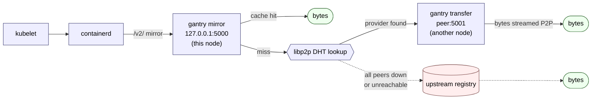

# Gantry

**Kill the registry thundering herd. Pull images peer-to-peer at 10,000-node scale.**

Gantry is a per-node daemon that turns every Kubernetes node into a
caching peer for OCI image content. Without changing your kubelet,
containerd, registry, or workloads, Gantry replaces the "every node
talks to the registry" pull pattern with a deterministic peer-to-peer
fabric — and bounds origin pulls to roughly one per unique blob per
cluster, no matter how many nodes you have.

## Why Gantry

### 1. The thundering herd is solved by construction

Roll a 10,000-replica Deployment of a 2 GiB image and naive container
runtimes will open 10,000 simultaneous TLS connections to your registry,
asking for the same bytes 10,000 times. That's the cost that dominates
large-scale rollouts: registry rate limits, NAT exhaustion, cluster ↔
registry link saturation, slow pod-startup p99s, and very real cloud
egress bills.

Gantry collapses that into **F1: one origin pull per unique digest per
cluster** — not per node, not per image, not per pod. Concretely:

- **Per-digest designated puller via rendezvous hashing (HRW).** Every
  node in the cluster independently computes the same rank order for
  any given digest. The rank-0 node is the only one that contacts the
  registry. Manifest, config, and each layer of an image generally HRW
  to *different* nodes, so origin contact is spread across N+2 nodes
  for an N-layer image — no single "image owner" hot-spot.
- **Receiver-side per-digest dedupe.** If 9,999 nodes all hit a cold
  digest at the same instant, the first `please_pull` RPC starts the
  origin pull; the other 9,998 get `already_pulling` immediately and
  switch to polling the DHT for the puller's Provide announcement.
  No registry-side coordination, no leader election, no Redis.
- **DHT-side polling, not puller-side polling.** Requesters wait on
  the DHT for the Provide record, not on the puller's HTTP endpoint.
  The 10,000-node herd never lands on a single node.
- **Negative caching of origin failures (§5.8).** A registry 4xx/5xx
  for one digest doesn't get re-tried by every node in lockstep.
- **Range-resumable peer transfers (RFC 7233).** A 2 GiB layer that
  dies at 1.7 GiB resumes from byte 1.7 G against another peer, not
  from byte 0 against the registry.

Net effect on a fully-cold N-node, M-layer rollout: roughly **M+1
origin pulls total** instead of N × (M+1).

### 2. Peer-to-peer image sharing as the hot path

Every Gantry agent is simultaneously a client and a server. Once any
node in the cluster has pulled a blob, the rest of the cluster can fan
it out laterally without ever touching origin again.

- **libp2p Kademlia DHT for provider discovery.** Sub-second lookup
  ("who has digest `sha256:abc…`?") at 10k-node scale; no central
  registry of who-has-what.
- **Plaintext HTTP/2 (h2c) for the bulk transfer hot path.** No TLS
  handshake tax on the inner-cluster pull, so layer transfer is
  bandwidth-bound, not handshake-bound.
- **Streaming digest verification on every byte received from a
  peer.** A malicious or buggy peer cannot poison your cache —
  bytes are hashed in-band through `internal/digestpipe` as they
  commit, and a digest mismatch fails the write atomically.
- **Sparse, demand-driven replication.** Each digest is replicated
  only to nodes that actually demanded it (plus its HRW-designated
  puller). No node holds the full image catalog; no per-cluster
  storage blowup.
- **Workloads are unchanged.** Kubelet and containerd are configured
  once via `hosts.toml` to mirror `/v2/` through the local agent on
  `127.0.0.1:5000`. The pod spec, the registry secret, the image
  reference — all untouched. Disable Gantry and the cluster falls
  back to direct origin pulls transparently.
- **Mesh-friendly.** Coordination plane (`:4001`) is libp2p with
  Noise transport encryption + Ed25519 peer identity. Transfer plane
  (`:5001`) is h2c that you can wrap in Istio / Linkerd / Cilium
  mTLS if your threat model needs it.

---

Concretely the data path looks like this:



## Design references

- [docs/archecture.md](docs/archecture.md) — system overview, requirements, scenarios.
- [docs/detailed-design.md](docs/detailed-design.md) — protocols, timeouts, failure modes, §7 metric catalogue.


## Building

Requires Go 1.26+ and `protoc` on `$PATH`.

```sh
make build        # build cmd/gantry into ./bin/gantry
make test         # run unit tests
make proto        # regenerate protobuf Go bindings
make proto-check  # CI check: bindings match committed .proto files
make lint         # golangci-lint (requires `make tools` first)
```

## Running locally

```sh
./bin/gantry agent \
  --mirror-listen 127.0.0.1:5000 \
  --transfer-listen 0.0.0.0:5001 \
  --metrics-listen 127.0.0.1:9095 \
  --cache-dir /var/lib/gantry/cache
```

A YAML config file matching `internal/config/config.go` is supported:

```sh
./bin/gantry agent --config /etc/gantry/config.yaml
```

All flags can be set via uppercase env vars too (e.g. `GANTRY_MIRROR_LISTEN`).

On Linux, the agent automatically connects to the local containerd over
`/run/containerd/containerd.sock` (namespace `k8s.io`) to discover
locally-cached images and announce them on the DHT. Override via
`--containerd-socket` / `--containerd-namespace`, or set socket to ""
to disable. Non-Linux builds skip this entirely.

### Endpoints

| Endpoint | Listener | Purpose |
| --- | --- | --- |
| `:5000` | loopback | OCI v2 mirror for containerd. Tag → 503 (forces digest-pinning). |
| `:5001` | peer-facing | OCI v2 subset for peer-to-peer transfer (`Gantry-Mirrored: 1` header). |
| `:4001` | libp2p | TCP + QUIC swarm + `/gantry/coord/1.0.0` stream protocol. |
| `:9095` | ops | `/metrics`, `/livez`, `/healthz`, `/readyz`. |

## Security model

Gantry is deliberately **cluster-internal** — there is no cross-cluster
federation, and confidentiality + integrity of the on-cluster traffic
rests on three controls layered together. If you peel one layer back you
must replace it with an equivalent control before deploying.

### Mirror endpoint (`:5000`) — loopback by default, hostPort opt-in

The mirror endpoint speaks plain HTTP and is reachable only from
containerd on the same node. Two patterns are supported:

- **Single-host / non-Kubernetes:** bind `mirror_listen: 127.0.0.1:5000`.
  The config validator hard-rejects any non-loopback address. This is
  the safe default for `make run`, local dev, and any deployment outside
  Kubernetes.
- **Kubernetes DaemonSet:** the pod binds `0.0.0.0:5000` inside its
  network namespace, and the DaemonSet exposes it through
  `hostPort: 5000` with `hostIP: 127.0.0.1`. The kubelet's CNI plumbing
  DNATs `127.0.0.1:5000` on the node into the pod, so containerd reaches
  the mirror over loopback even though the pod itself binds widely.
  Because the pod-side bind isn't literally loopback, the operator must
  set `mirror_bind_allow_non_loopback: true` (env
  `GANTRY_MIRROR_BIND_ALLOW_NON_LOOPBACK=1`, flag
  `--mirror-bind-allow-non-loopback`) to disarm the validator. This is
  an **explicit opt-in**: do not enable it without also configuring
  `hostPort.hostIP: 127.0.0.1` (or an equivalent kernel-level barrier),
  because the mirror endpoint is intentionally not authenticated and
  containerd's `skip_verify: true` mirror config trusts whatever serves
  it. The shipped `deploy/daemonset.yaml` + `deploy/configmap.yaml`
  already wire this correctly; the flag exists so non-DaemonSet rollouts
  (e.g. systemd unit on a bare metal node behind a host firewall) can
  consciously take the same shortcut.

### Peer transfer endpoint (`:5001`) — h2c, NetworkPolicy-gated

The peer-to-peer transfer endpoint runs **plaintext HTTP/2 (h2c)**.
That is a deliberate tradeoff:

- Cluster-internal traffic only. Off-node reachability is blocked by the
  shipped `deploy/examples/networkpolicy.yaml` hardening overlay
  (ingress restricted to peer agents and the kubelet). The overlay is
  intentionally not part of the default `kubectl apply` workflow
  because every rule defers a CIDR choice to the operator — see
  `deploy/README.md` for the workflow. If your CNI does not enforce
  NetworkPolicy, you must replace it with an equivalent firewall
  before running Gantry in production.
- A `Gantry-Mirrored: 1` request header is required on every peer call;
  the handler 400s anything else. This is **not** an authentication
  mechanism — it stops accidental mis-routes (e.g. a misconfigured curl
  hitting the wrong port), nothing more.
- The integrity backstop is in-band digest verification. Every blob
  pulled from a peer is streamed through the digest-pipe in
  `internal/digestpipe` while it is being committed to the local cache;
  a peer that returns wrong bytes fails the commit and the consumer
  retries another provider. A peer **cannot** poison the cache by
  returning attacker-chosen bytes, because the digest the requester
  asked for is hashed independently as the bytes arrive.
- Range requests use standard RFC 7233 semantics (`Range: bytes=N-M` →
  `206 Partial Content` with `Content-Range`); the digest-pipe is
  applied to the full object on commit, not per-range.

What h2c is **not** defending against:

- A malicious workload sharing the cluster network with the agent can
  read peer-to-peer traffic in transit. If that is in your threat model,
  terminate Gantry traffic on a mesh (Istio / Linkerd / Cilium mTLS)
  before deploying, or wait for the post-GA mTLS option (tracked in
  the design doc §4.4 follow-ups). Image bytes are typically already
  public (pulled from a public registry), so this is rarely the right
  knob to turn first.
- A compromised peer that happens to *also* hold a digest can serve that
  digest. NetworkPolicy ingress + a controlled image-pull list is the
  defense; assume every node in the DHT can serve every digest it has
  legitimately pulled.

### Coordination plane (`:4001`)

The libp2p Kademlia DHT and `/gantry/coord/1.0.0` stream protocol are
authenticated by libp2p peer identity (Ed25519 keypair persisted at
`libp2p_identity_path`). Stream traffic is encrypted by libp2p's
built-in TLS / Noise transport — this is independent of the h2c
transfer endpoint and is **not** affected by the section above.

## Deployment

See [deploy/README.md](deploy/README.md) for the full Kubernetes rollout
recipe: ServiceAccount + RBAC, ConfigMap, DaemonSet, distroless image,
the per-node `hosts.toml` containerd configuration, and the optional
`examples/networkpolicy.yaml` hardening overlay.

```sh
kubectl apply -f deploy/serviceaccount.yaml
kubectl apply -f deploy/configmap.yaml
kubectl apply -f deploy/registry-secret.example.yaml   # edit first
kubectl apply -f deploy/daemonset.yaml
# Optional, AFTER verifying rollout: copy and edit
# deploy/examples/networkpolicy.yaml into your own overlay first;
# see deploy/README.md § Hardening overlays.
```

## Contributing

1. `make tools` once to install `protoc-gen-go` and `golangci-lint`.
2. Run `make check` (vet + tests) before every commit.
3. `make proto-check` must be green if any `proto/**/*.proto` changed.
4. Conventional commits (`feat:`, `fix:`, `chore:`, `docs:`) are preferred.
5. Substantive changes should cite the relevant `docs/detailed-design.md`
   section in the commit message or PR description.

## License

[MIT](LICENSE)