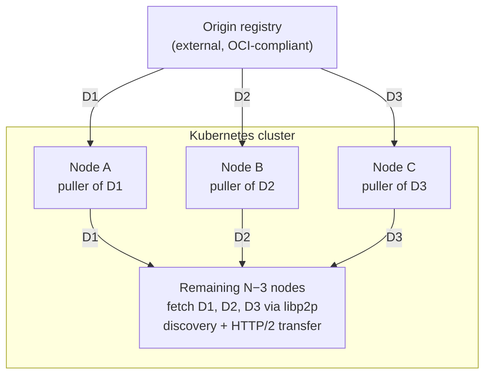
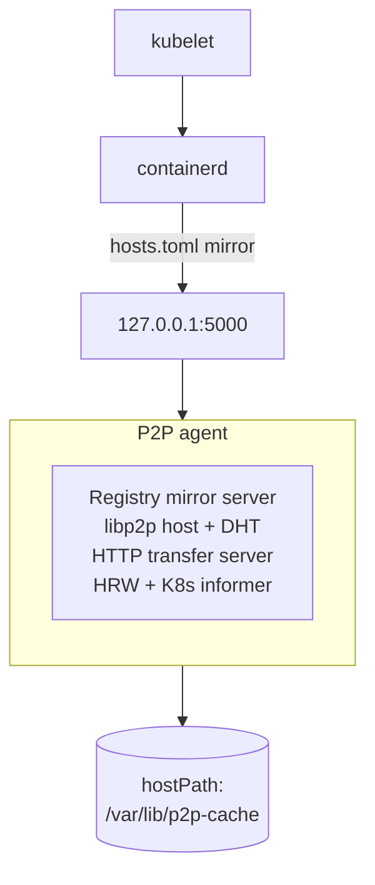

# Gantry

Kubernetes clusters at 10k+ node scale routinely deploy the same container image across many nodes simultaneously. Naive behavior — every node pulling from the upstream registry — produces a thundering herd at the origin: 10,000 simultaneous TLS handshakes, registry-side rate limiting, link saturation between cluster and registry, and slow rollouts. This is the dominant cost of large-scale rollouts and a known operational pain point.

This document proposes a cluster-local peer-to-peer distribution layer: the origin registry is contacted **at most a small constant number of times per unique content digest** (manifest, config, or layer), after which the content propagates through the cluster between peer nodes. The design is fully decentralized, uses libp2p for content discovery only, and uses rendezvous hashing per digest to coordinate cold-start pulls without leader election or central state.

---

## Requirements

| ID  | Requirement |
|-----|-------------|
| F1  | The system pulls each unique content **digest** (manifest, config, or layer) from the origin registry **at most a small constant number of times per cluster** under normal operation — typically exactly once, bounded by ≤3 during transient informer-convergence windows (§3). Scope is digest-keyed requests only; tag-keyed cold-start is outside F1 (§1a). |
| F2  | Image pulls by `kubelet` / `containerd` are served transparently — no changes to pod specs or workload configuration. |
| F3  | The agent runs as a Kubernetes DaemonSet. No PVCs, no per-node persistent identity managed by Kubernetes. |
| F4  | Peer discovery uses libp2p (Kademlia DHT). No central tracker or registry-side coordination is required. |
| F5  | Cold-start coordination (no peer has the digest yet) uses rendezvous hashing (HRW) **per digest** to deterministically select a designated puller. Each digest is coordinated independently. |
| F6  | When a digest is not yet cached anywhere, exactly one node pulls it from origin in the common case; redundant pulls occur only under failure (e.g., partition). |
| F7  | Content received from peers is verified against OCI digests before being served to `containerd`. |
| F8  | The system supports any OCI-compliant upstream registry. |
| F9  | Tag references (`manifests/<tag>`) resolve directly at origin via containerd's `hosts.toml` mirror-fallback chain. The agent maintains no tag→digest cache, no tag-keyed DHT advertisements, and no agent-layer tag freshness logic; only digest-keyed requests are routed through the P2P layer. |

---

## Architecture overview

Each unique digest is pulled from origin at most a small constant number of times cluster-wide. Per-digest HRW spreads cold-start origin contact across the cluster: an image's manifest, config, and layer digests generally HRW to *different* nodes, so origin contact is not concentrated on a single "image owner." No traffic flows between the pullers themselves; each independently fans out its digest to the rest of the cluster.

Per-node layout:

---

## API

The agent exposes two wire surfaces, versioned independently.

**Coordination RPCs (libp2p).** Two message kinds carried over a single libp2p protocol:

- `pull_intent_query(digest)` — "Do you have this digest cached? Are you currently pulling it? Have you recently failed to pull it?" Used by a requester probing the HRW top-K to distinguish three cases that the DHT alone cannot: digest already in flight, digest already cached but the DHT lookup was a false-empty, or genuinely cold.
- `please_pull(digests, upstream_registry, repository)` — "Please pull these digests from origin on my behalf." Sent by a requester to the lowest-ranked reachable top-K node once a true cold-start has been established. Digests in one batch share a registry and repository; cross-repo digests use separate calls. The puller's per-digest response indicates outcome (already pulling, started, recently failed) and any active cooldown.

Forward compatibility uses additive-minor / breaking-major bumps on the libp2p protocol ID. See [detailed-design.md](detailed-design.md#44-wire-protocols) for the protobuf schema, framing, and field semantics.

**Transfer endpoint (HTTP).** Each agent binds an HTTP/2 server on a peer-facing port that is distinct from the loopback containerd-mirror endpoint and is restricted to inter-node traffic by NetworkPolicy. The endpoint mirrors the OCI Distribution API so peer-side code reuses the same registry-client codepath:

- `GET /v2/` — capability probe.
- `GET /v2/<repo>/blobs/sha256:<hex>` — blob bytes. `Range` is supported at the protocol level to unblock future multi-peer striping without a protocol change, even though v1 clients always fetch whole blobs.
- `GET /v2/<repo>/manifests/sha256:<hex>` — manifest bytes by digest.
- `GET /v2/<repo>/manifests/<tag>` — tag-keyed requests are **not handled by Gantry**, and the response differs by endpoint:
  - On the **peer-facing** port, the request indicates a misconfigured peer (peers never request tags in v1) and returns `404`.
  - On the **containerd-mirror loopback** port, the request is the design-intended path (§1a) and returns a 5xx so that containerd's `hosts.toml` fallback chain promotes the request to the next host.
- `GET /healthz` — liveness / readiness.

**Peer-fetch mode header.** A requesting agent sets a `Gantry-Mirrored` marker header on every fetch to a peer's transfer endpoint. Its presence switches the serving peer's handler into peer-fetch mode: serve only from local store, return `404` on miss, and never chain into DHT lookup, HRW probe, `please_pull`, or origin contact. The header is a behavior switch, not an authorization mechanism — trust derives from NetworkPolicy scoping the peer-facing port to inter-node traffic.

---

## Scenarios

Manifest requests come in two forms: by digest (`manifests/sha256:...`) and by tag (`manifests/<tag>`). Tag requests are not content-addressable and are handled separately (§1a). All other requests — manifests by digest, config blobs, and layer blobs — go through the digest-keyed warm path (§1) or cold-start path (§2).

### 1 Warm path — digest-keyed content exists in cluster

On a local-cache miss, the agent looks up providers of the digest in the DHT, picks a reachable provider, and streams the bytes from that provider's transfer endpoint with the peer-fetch header set. The stream is digest-verified incrementally and written to the local cache while being streamed back to containerd. On completion, the agent advertises itself as a new provider via `dht.Provide`.

If a chosen provider stalls or errors mid-stream, the agent fails over to the next provider returned by the DHT lookup. After exhausting a small number of providers in succession, the agent returns a 5xx to containerd, which falls through its `hosts.toml` mirror chain to origin.

v1 ships **single-peer fetch** (one provider per blob, whole-blob GET). The transfer endpoint preserves `Range` support so v2 can add multi-peer striping without a protocol change. See [detailed-design.md §5.1](detailed-design.md#51-warm-path--digest-keyed-content-exists-in-cluster) for v1 timeout and retry constants and the v2 striping sketch.

### 1a Tag reference path

Containerd resolves `image:tag` to a digest by fetching `manifests/<tag>` from the origin before any blob requests. **Gantry v1 does not handle this resolution.** When the agent receives a tag-shaped manifest request on its containerd-mirror loopback endpoint, it returns a 5xx immediately and containerd's `hosts.toml` fallback chain promotes the request to origin. Origin resolves the tag; containerd records the binding in its own image table; the agent observes the resulting digests via image events and routes the subsequent config and layer pulls through the digest-keyed warm or cold-start paths (F1-bounded).

The agent maintains **no tag→digest cache, no tag-keyed DHT advertisements, and no tag-freshness logic.** This eliminates the tag-rebinding coherence problem that a separate agent-layer cache would otherwise create, and preserves OCI's "tag is a pointer at origin, resolved on every pull" semantic exactly.

**Costs of this choice:**

- Every pod-start incurs one origin contact for tag resolution. The cost per contact is small (manifest body only — typically a few KB — plus one TLS handshake); layer bytes remain F1-bounded via the digest-keyed path.
- The cluster-wide tag-resolution rate scales with **pod-start rate, not cluster size**, and does not decrease with more nodes.
- When origin is unreachable, tag-keyed pulls fail across the cluster. Digest-keyed pulls (running pods, pinned digests in pod specs, image-restart of already-cached images) continue peer-to-peer.

**Operator guidance for tag-keyed workloads under partition risk:**

1. **Pin digests in pod specs** (`image: registry/repo@sha256:...`). Strongest guarantee — no tag-resolution path is taken at all.
2. **Use `imagePullPolicy: IfNotPresent`** so kubelet skips re-resolution on already-cached nodes. This is already kubelet's default for any tag other than `:latest`.
3. **Wait for the v2 HRW-with-TTL mechanism** described in [detailed-design.md §8](detailed-design.md#8-open-questions), which restores peer-served tag resolution within a bounded staleness window.

### 2 Cold-start path — no provider exists

The interesting case. **Applies to digest-keyed requests only**; tag references are handled by §1a.

**HRW is per digest, not per image.** Each digest is coordinated independently. The agent runs this flow once per digest as containerd requests them; digests of one image generally HRW to different nodes (see §2a).

**DHT-empty is not ground truth.** A `FindProviders` result of empty can mean genuinely no provider, a slow or timed-out lookup, a sparse local routing table, or provider records that expired under DHT load. The agent therefore treats the DHT as a fast-path optimization and uses the **HRW top-K probe as the authoritative cold-start arbiter**. HRW is local-only, deterministic, and unaffected by DHT health, so the cold-start decision routes around DHT degradation by construction.

**Decision flow on cache miss:**

1. Look up providers in the DHT. **Hit:** proceed to the warm path. **Empty:** do not yet infer cold-start.
2. Compute HRW for the digest over the local informer view of cluster membership; select the top-K (default K=3).
3. Dial all K in parallel with `pull_intent_query(digest)`. Each response carries `has_cached`, `in_flight` with `started_at`, and the origin-failure circuit-breaker state from §8 if applicable.
4. Evaluate the response set against priority-ordered rules; **first matching rule wins:**
   - **Cluster-wide failure short-circuit.** Any reachable node reports a recently-failed origin pull with a cluster-trusted failure class (`auth` / `not_found` / `rate_limited`) → return failure to containerd immediately. Other top-K nodes will see the same answer.
   - **Cache hit.** Any reachable node reports cached → fetch from that node via the warm path. The DHT lookup was a false-empty.
   - **In-flight piggyback.** Any reachable node reports a fresh in-flight pull → poll the local DHT for the puller's eventual `dht.Provide`.
   - **Transient cooldown.** Any reachable node reports a transient origin failure → apply a bounded local honor window before retrying.
   - **All-unreachable expansion.** No top-K node responded → expand the probe to top-2K and re-evaluate. Independent of DHT health.
   - **Degraded-health eager expansion.** Under Degraded DHT health, "honest neither cached nor in-flight" answers from the top-K may be wrong; expand to top-2K before declaring cold-start.
   - **Cold-start.** Only if all reachable top-K honestly report neither cached nor in-flight nor recently failed, and no expansion rule applies, proceed to step 5.
5. Send `please_pull(digest)` to the lowest-ranked reachable top-K node. That node either starts the origin pull or responds `already_pulling` (per-digest receiver-side dedupe).
6. Poll the local DHT for the puller's `dht.Provide`. On hit, fetch via the warm path.

**Why this matters under DHT pathology.** A false DHT-empty is caught at the top-K probe: the rank-0 node is almost always still a provider, and the request is served peer-to-peer with no origin contact. DHT degradation produces only a small RPC-overhead penalty, not an origin storm.

**Residual gap.** A digest cached only on nodes outside the current top-2K (e.g., a former rank-2 that is now rank-47 after cluster growth) is invisible to this probe. The eviction policy partly mitigates this by deferring eviction when the local node is one of few providers, so historical pullers tend to remain providers. See [detailed-design.md §5.2](detailed-design.md#52-cold-start-path--no-provider-exists) for timeouts and the DHT-health-state semantics.

### 2a Per-digest cold-start in practice

Containerd's pull sequence is fixed: manifest → config → layers (in parallel). The agent runs §2 once per digest as containerd asks for it, with two timing regimes:

- **Manifest and config digests.** kB-scale. Cold-start uses a fixed short timeout and a fast local-DHT polling interval while waiting for the puller's `dht.Provide`. Manifest lists and per-arch manifests are each handled as independent digests; platform selection happens entirely inside containerd.
- **Layer digests.** Once the manifest is parsed, layer sizes are known. Cold-start uses a **size-aware timeout** derived from layer size and a floor bandwidth assumption; the polling interval is slower than for manifest/config because layers take longer and polling cost is amortized over a longer pull. Layer cold-starts run **in parallel** for all layers that miss the DHT — they do not serialize.

**Polling targets the local DHT, not the puller's transfer endpoint.** A direct poll against the puller from thousands of requesters during a thundering-herd cold-start would concentrate inbound HTTP load on one node on top of its actual transfer load. The DHT path spreads polling cost across the network and benefits from libp2p's per-node lookup caching.

**Batched `please_pull` for layers.** When multiple cold-start layers all HRW to the same designated puller, the agent may batch them into a single `please_pull([digest1, digest2, …])`. Receiver-side per-digest dedupe is unchanged; batching is purely a wire-level RPC reduction. Pullers SHOULD reuse a single TLS connection to origin across digests of the same image — a local implementation concern, not a protocol-visible behavior.

**Origin pulls per fully-cold image.** Up to N+2 origin pulls (manifest + config + N layers), each from a potentially different designated puller. This is the F1 invariant: **one origin pull per unique digest, not per image**, generally distributed across N+2 different nodes — bounded, parallel, and load-balanced by construction. See [detailed-design.md §5.2a](detailed-design.md#52a-per-digest-cold-start-in-practice) for concrete timeout and polling values.

### 3 Concurrent cold-start requests (thundering herd)

The scenario the design exists to handle: 10,000 nodes all want image Y in the same second.

Because HRW is deterministic and inputs (node list + digest) are identical across the cluster, all 10,000 requesters arrive at the same top-K for any given digest, and at the same lowest-ranked reachable node for `please_pull`. **Per-digest receiver-side dedupe** handles the burst: the first request starts the pull, the other 9,999 receive `already_pulling` immediately. All 10,000 then poll the DHT and switch to the warm path as soon as the puller advertises.

Different digests of one image generally produce different top-K sets, so the inbound RPC load spreads across many nodes rather than concentrating on three. For a fully-cold image with N+2 unique digests, **origin sees N+2 pulls cluster-wide — not N+2 per node.**

**Caveat — informer divergence (accepted limitation).** The "one pull per digest" property assumes every agent has the same node list at the same instant. Kubernetes informer caches lag during membership changes, and divergent views can select different rank-0 nodes concurrently for the same digest. Receiver-side dedupe bounds the damage at each puller, but **cross-puller dedupe does not exist** — so during rolling updates the property degrades from "one origin pull" to "a small number, bounded by the number of distinct rank-0 selections across divergent views" (anticipated ≤3 per affected digest). F1 reflects this with "small constant." The design accepts this rather than introducing a synchronized membership protocol, which would be exactly the kind of side-channel coordinator the design forbids.

### 4 Designated puller has no local demand

The case where rank-0's HRW says "you pull this digest," but no pod on rank-0 is asking for it. Handled automatically: a requester's explicit `please_pull` makes rank-0 pull even with no local pod demand. After completion, rank-0 serves the content to peers; it may later evict the content if it remains the only consumer.

### 5 Designated puller is down or unreachable

`pull_intent_query` to rank-0 times out. The requesting agent's reachable top-K set excludes rank-0; rank-1 becomes the lowest-ranked reachable node; `please_pull` goes to rank-1, which starts pulling. The takeover is **bounded by the dial timeout, not by content size** — this is the central reason for fan-out probe over single-target dial.

### 6 Designated puller stalls mid-pull

The puller responded "starting" but its origin connection is now hung. The provider record never appears in the DHT. Requesters polling the DHT eventually hit a per-digest max-wait timer and **re-run the cold-start flow for that digest only** — other digests of the same image are unaffected and may be progressing normally on different pullers. The new probe sees rank-0's in-flight state with a stale `started_at`, treats the pull as stalled, and excludes rank-0 from `please_pull` candidates. Rank-1 takes over in parallel with rank-0's hung attempt; whichever completes first calls `Provide`. Origin sees two pulls of the stalled digest in the worst case — an acceptable price for liveness.

### 7 Network partition

The cluster splits into partitions A and B. Each partition independently selects a designated puller from its own reachable view of cluster membership. Both partitions make progress; origin sees one extra pull per partition. When the partition heals, both pullers are providers and the DHT merges naturally. **Liveness is preserved at the cost of one extra origin pull per partition.**

Negative-cache entries (§8) are puller-local and do not merge across partitions; the worst case after heal is a stale cooldown that delays a retry by at most the configured cooldown ceiling. The eviction policy's provider-count check reflects only the local partition's view during the split, which may make deferral over-conservative or under-protective until DHT records reconverge after heal.

### 8 Origin is down or rejecting pulls

The designated puller maintains a **per-digest negative cache with circuit-breaker semantics** to avoid both (a) returning failure indefinitely while origin recovers, and (b) every subsequent requester re-triggering a fresh puller cascade against a known-broken origin.

**Failure classification.** On terminal failure of an origin pull, the puller classifies the cause:

- `auth` (401 / 403) — same credentials will fail identically everywhere; cluster-relevant.
- `not_found` (404) — same digest is missing everywhere; cluster-relevant.
- `rate_limited` (429) — origin is back-pressuring; respect it.
- `transient` (connection refused / reset, 5xx, timeout, DNS failure) — may be intermittent or flapping.

Cooldown is exponential and capped. The first successful pull of the digest clears the entry.

**Signal propagation reuses the existing probe RPCs (no new RPCs).** While a digest is in cooldown, `pull_intent_query` and `please_pull` responses surface `recently_failed`, `cooldown_until`, and the failure class. Requester behavior depends on the class:

- **`auth`, `not_found`, `rate_limited`: trusted cluster-wide.** Requester returns failure to containerd immediately; no `please_pull` to any node for this digest. Cluster-wide origin pull rate is bounded to **one attempt per cooldown interval per affected digest**, regardless of how many requesters are waiting.
- **`transient`: trusted per-digest, bounded local honor window only.** Requester waits before retrying any top-K node. A flapping origin will fail rank-1 the same way it failed rank-0; sequential retries inside the cooldown only generate origin pressure.

**Self-healing.** When origin recovers, the next attempt after cooldown succeeds, the puller clears the negative-cache entry, advertises via `Provide`, and the warm path activates. No operator action required.

**Why the negative cache is local-only, not propagated via DHT.** A stale cluster-wide "this digest failed" marker outliving an actual recovery would be a serious bug. The puller-plus-honor-window pair already bounds the cascade adequately without introducing eventual-consistency hazards.

**Distinguishing puller failure from origin failure.** A puller that has crashed or is unreachable returns no `recently_failed` response — the requester sees a TCP-level timeout and §5's takeover applies. The negative cache is only consulted when the puller is alive and able to respond. Puller failures should reroute; origin failures should back off.

See [detailed-design.md §5.8](detailed-design.md#58-origin-is-down-or-rejecting-pulls) for the cooldown schedule, honor-window bounds, and operator-tunable knobs.

### 9 Node joins / leaves cluster

- **Join.** The Kubernetes informer reports the new node to all agents within a few seconds and HRW rankings update naturally. The new agent bootstraps its libp2p host from the informer's existing pod list and joins the DHT.
- **Leave.** Provider records held by the departed node expire from the DHT via TTL. HRW rankings update on all surviving agents as the informer removes the node. If the departed node was a designated puller for an in-flight pull, §6's stall-detection recovers.

For protocol-level detail — protobuf schemas, step-by-step timeout and retry constants, the failure-modes summary table, implementation notes (containerd integration, libp2p configuration, cache and eviction, metrics, DHT health gating, authorization model), and open questions — see [detailed-design.md](detailed-design.md).

---

## Key design decisions

- **libp2p for discovery only, not transfer.** Discovery (find peers with content X) is what Kademlia is good at. Bulk content transfer rides on plain HTTP/2 against a dedicated peer-facing port the DaemonSet exposes (see API below). This lets transfer benefit from kernel-level TCP optimizations, standard HTTP tooling for debugging, and a clean substrate for future range-based multi-peer striping. v1 ships single-peer fetch (the requester picks one provider and streams the whole blob); range-based parallel striping across multiple peers is supported by the endpoint contract but deferred to v2 — see §1.

- **Per-digest granularity, end to end.** Provider records, HRW computation, and cold-start coordination all operate on individual OCI digests, not on "images." An image is a manifest digest plus a config digest plus N layer digests; the agent treats these as N+2 independent units. Two images sharing a base layer share providers automatically. Cold-start for a fully-uncached image fans out to up to N+2 different designated pullers in parallel — one per digest — which maximizes ingress parallelism and spreads load across the cluster (popular base layers naturally HRW to different nodes per image-that-uses-them, rather than concentrating on a single "image owner"). Per-chunk granularity (for pipelined distribution of large layers) is deferred until empirical data justifies the additional complexity.

- **Tradeoff: per-digest HRW costs N+2 separate origin TLS handshakes.** For a fully-cold N-layer image, origin sees up to N+2 TLS handshakes from up to N+2 distinct source IPs — not 1 handshake reused across N+2 keepalive'd requests as the single-puller-per-image alternative would produce. The puller-side TLS connection reuse described in §2a only helps when batched `please_pull` lands multiple digests on the same puller (the exception under uniformly-distributed HRW, not the rule). This is a deliberate tradeoff: image-pull rollouts are bursty events, and a registry that pushes back on N+2 simultaneous handshakes from distinct cluster nodes would push back harder on the thundering-herd alternative the design exists to prevent. Revisit only if real-world registries report per-handshake (rather than per-byte or per-request) cost as the binding constraint.

- **Separate content cache, not co-located with containerd's content store.** v1 maintains the agent's content cache on `hostPath` independently of containerd's content store at `/var/lib/containerd/io.containerd.content.v1.content`. Popular content is therefore on disk twice on each node; at the configured 50 GB cache and 10k nodes, worst-case cluster-wide duplication is on the order of 500 TB. The duplication is a deliberate v1 simplification with three justifications: (i) the agent's cache has provider-count-aware lifetime under detailed-design.md §7.4, which containerd's GC has no concept of; (ii) the agent does not need read access to containerd's content directories or knowledge of containerd's internal layout (which varies by version and snapshotter); (iii) restart recovery is self-contained — walk one directory tree, advertise everything. Serving directly from containerd's content store would eliminate the duplication and is the natural v2 candidate once v1 is validated at scale; see detailed-design.md §8 open question.

- **Tags resolve directly at origin; Gantry routes only digests.** Tag references (`registry/repo:tag`) are not content-addressable, and v1 deliberately does not route them through the P2P layer. When containerd asks the local agent for `manifests/<tag>`, the agent returns `5xx` immediately, and containerd's `hosts.toml` mirror-fallback chain reaches origin directly using that node's own credentials. Origin performs the tag→digest resolution; containerd records the binding in its own image table; the agent observes the resulting digests via image events (detailed-design.md §7.3) and routes them through the normal digest-keyed P2P path (§1 / §2, F1-bounded). The agent maintains **no tag→digest cache, no tag-keyed DHT advertisements, and no tag-freshness logic**. This eliminates the tag-cache coherence problem that would otherwise arise from detailed-design.md §7.4's separate-cache decision (a separate cache with its own GC would need either a tag-binding TTL/refresh mechanism or some other invalidation discipline to stay consistent with origin), and preserves OCI's "tag is a pointer at origin, resolved on every pull" semantic exactly. The cost is per-node origin contact for the tag-resolution step (small — manifest body only, typically a few KB; layer and config bytes remain F1-bounded via the digest-keyed path) and loss of tag-pull availability under origin partition. detailed-design.md §8 documents an HRW-coordinated TTL-refresh mechanism as a v2 candidate for operators who need bounded-staleness peer-served tag resolution.

- **Stateless agent (from the orchestration perspective).** The pod itself has no Kubernetes-managed state — no PVCs, no per-node identity managed by Kubernetes. Cache and (optionally) libp2p identity live on `hostPath`. The agent does maintain in-memory state — in-flight pull map, recent-failures negative cache (§8), DHT health rolling stats (detailed-design.md §7.7), informer cache — but all of it is reconstructible from the on-disk cache and Kubernetes informer on restart. On pod restart, the agent rebuilds its peer view from the Kubernetes informer and re-announces cached content to the DHT.

- **Direct RPC for cold-start coordination, with HRW top-K probe as authoritative discovery on DHT miss.** When DHT lookup returns no providers, the agent does **not** treat that as ground truth. `dht.FindProviders` returning empty is ambiguous — it may mean genuinely no provider, slow/timed-out lookup, sparse local routing table, or expired provider records under load. The agent therefore treats the DHT as a fast-path optimization and uses HRW top-K probe as the authoritative discovery mechanism on DHT miss: it dials the K HRW-ranked nodes for the digest with an enriched query that asks both "do you have it cached?" and "are you already pulling it?". Only if all reachable top-K answer "neither" is the request treated as a true cold-start. HRW computation is local and deterministic and does not depend on DHT health, so this routes around DHT degradation entirely. No PubSub layer. No heartbeat protocol. Receiver-side dedupe handles concurrent requests.

- **Replication-aware cache eviction; no tag- or image-level GC.** The on-`hostPath` cache uses layer-level LRU with a **provider-count deferral**: before evicting a layer the agent queries the DHT for its provider count, and if the local node is one of fewer than N providers (default 3), eviction is deferred to the next LRU candidate. This keeps rare content alive in the cluster on the right axis — replication, not reference-counting — and is the property that earns the right to maintain a separate cache from containerd's content store (which has no concept of replication-aware lifetime). A hard headroom ceiling (default: free disk < 5% of cache budget) forces eviction regardless of provider count to prevent deferral deadlocks under cache pressure. Image deletions in containerd trigger no agent-side action on the underlying digests, because Gantry holds no tag→digest state and layers are shared across images at the digest level — replication-aware LRU is the only GC mechanism. See [detailed-design.md §7.4](detailed-design.md#74-cache-and-eviction).
